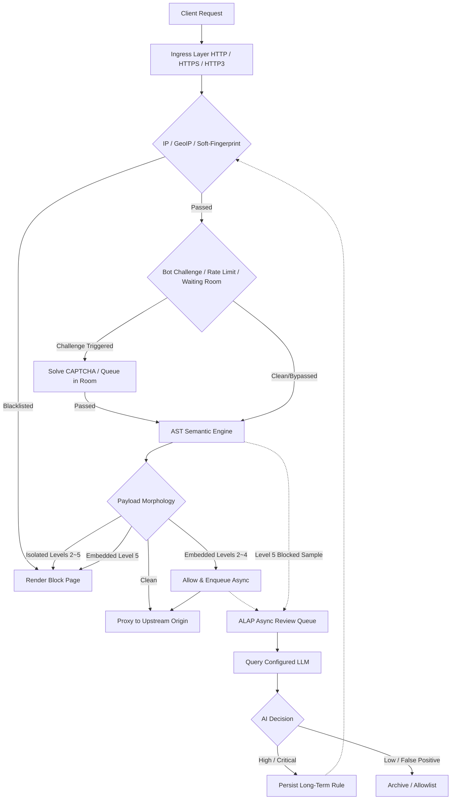

CheeseWAF structures traffic evaluation into two distinct lifecycles: the **Synchronous Inline Inspection Path** and the **Asynchronous Out-of-Band Review Path**. The diagram below illustrates the end-to-end flow of an incoming HTTP/HTTPS/HTTP3 request:

## Pipeline Lifecycle Breakdown {#pipeline-details}

### 1. Synchronous Forwarding Path (Solid Lines) {#sync-path}

The synchronous path handles real-time client-to-origin communication, prioritized for high throughput and sub-millisecond latency:

- **Ingress & Network Layer Filtering**: Evaluates IP whitelists/blacklists, GeoIP country bans, and client TLS soft-fingerprints. Requests matching blacklists are rejected immediately with a block page.
- **Access Control & Anti-Scraping**: Evaluates bot challenges, token bucket rate limits, and waiting room capacity. Suspicious clients must complete JavaScript challenges or solve CAPTCHAs before proceeding.
- **Semantic Analysis & Policy Evaluation**: Performs parameter decoding and builds AST representations to detect attack syntax, executing an immediate block or pass decision based on the configured Paranoia Level.
- **Origin Reverse Proxying**: Clean requests are dispatched to healthy backend upstream servers according to configured load balancing policies.

### 2. Asynchronous Review Path (Dashed Lines) {#async-path}

The asynchronous path operates out-of-band after the client has already received its response:

- **Sample Enqueuing**: Embedded payloads allowed under paranoia levels 2–4 and high-severity attacks blocked at level 5 are placed into the ALAP review queue.
- **LLM Reasoning**: Background workers query the configured LLM API to extract malicious intent and calculate confidence scores.
- **Closed-Loop Rule Persistence**: Threats confirmed as high (`high`) or critical (`critical`) can be automatically or manually committed as long-term IP blacklists or custom signature rules.

{}
When `waf.mode` is set to `block`, paranoia levels 2–5 enforce blocking rules. Under level 0 (log only) and level 1 (monitoring), the system records alerts without terminating requests. For filter configuration details, see [Security Policies](../../protection/).
{}
