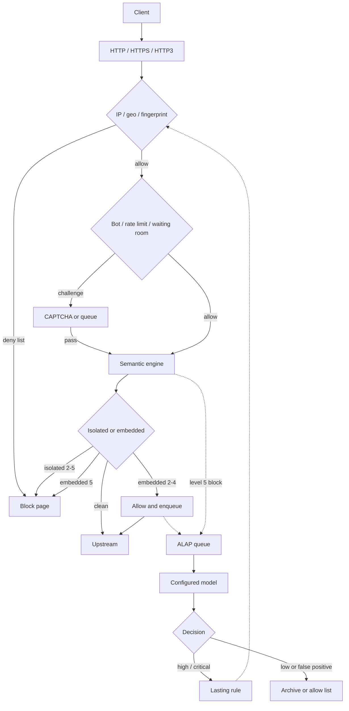

Solid arrows stay on the request path.
Dashed arrows run after the client already has a response.

Site-level `waf.mode` can be `block` or a record-only style depending on paranoia.
Level 0 and 1 never block on semantic hits.

See [Protection](../../protection/) for each filter in this diagram.
