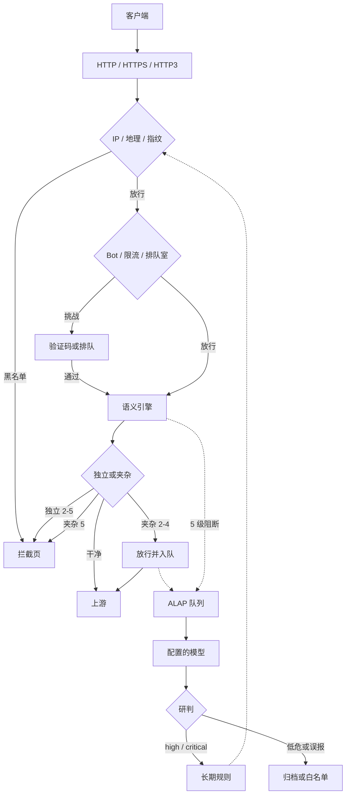

```mermaid
flowchart TB
  Client[客户端] --> Ingress[HTTP / HTTPS / HTTP3]
  Ingress --> IP{IP / 地理 / 指纹}
  IP -->|黑名单| Block[拦截页]
  IP -->|放行| Bot{Bot / 限流 / 排队室}
  Bot -->|挑战| Challenge[验证码或排队]
  Challenge -->|通过| Sem
  Bot -->|放行| Sem[语义引擎]
  Sem --> Shape{独立或夹杂}
  Shape -->|独立 2-5| Block
  Shape -->|夹杂 5| Block
  Shape -->|夹杂 2-4| Pass[放行并入队]
  Shape -->|干净| Origin[上游]
  Pass --> Origin
  Pass -.-> Queue[ALAP 队列]
  Sem -.->|5 级阻断| Queue
  Queue --> LLM[配置的模型]
  LLM --> Review{研判}
  Review -->|high / critical| Rule[长期规则]
  Review -->|低危或误报| Dismiss[归档或白名单]
  Rule -.-> IP
```

实线箭头在请求路径上。
虚线箭头在客户端已经拿到响应之后才跑。

站点级 `waf.mode` 可以是 `block`。
等级 0 和 1 不会因为语义命中而阻断。

图里每一层过滤器见 [防护](../../protection/)。
