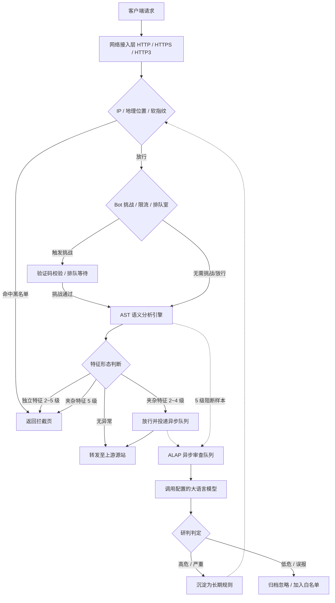

CheeseWAF 的流量处理链路分为**同步检测链路**与**异步旁路研判链路**两大部分。下图展示了一个 HTTP/HTTPS/HTTP3 请求进入系统后的完整流转过程：

## 链路详解 {#pipeline-details}

### 1. 同步转发链路（实线部分） {#sync-path}

同步链路直接承载客户端与源站之间的实时通信，核心要求为高吞吐与低时延：

- **接入与网络层过滤**：请求到达接入层后，首先经过 IP 白名单、黑名单、GeoIP 国家/地区封禁及客户端软指纹校验。命中黑名单将直接返回拦截页。
- **访问控制与防刷**：通过 IP 校验后，进入 Bot 挑战验证、令牌桶限流及排队室模块。异常客户端需完成 JS 挑战或验证码后方可通行。
- **语义分析与策略判定**：通过参数解码与 AST 语法树解析，引擎识别请求中的攻击特征，并结合站点当前的防护等级（Paranoia Level）决定执行当场阻断（Block）还是放行（Pass）。
- **源站反向代理**：合法流量经负载均衡策略转发至健康的后端源站。

### 2. 异步旁路研判链路（虚线部分） {#async-path}

异步链路完全独立于实时转发流程，在客户端完成响应接收后于后台触发：

- **样本投递**：在防护等级 2～4 下被放行的夹杂特征样本，以及在等级 5 下被阻断的高危样本，均会被投递至 ALAP 审查队列。
- **模型智能分析**：后台 Worker 异步调用大模型提取攻击意图并输出置信度评估。
- **闭环规则沉淀**：判定为高危（`high`）或严重（`critical`）的威胁，可通过人工审核或自动采纳机制，实时回写为 IP 黑名单或特征规则，实现自适应安全加固。

{}
当站点的 `waf.mode` 设为 `block` 时，防护等级 2～5 将按规则执行拦截；若处于等级 0（仅记录）或等级 1（监控），系统仅记录日志而不会中断请求。各层过滤器的具体配置请参考 [安全防护](../../protection/)。
{}
